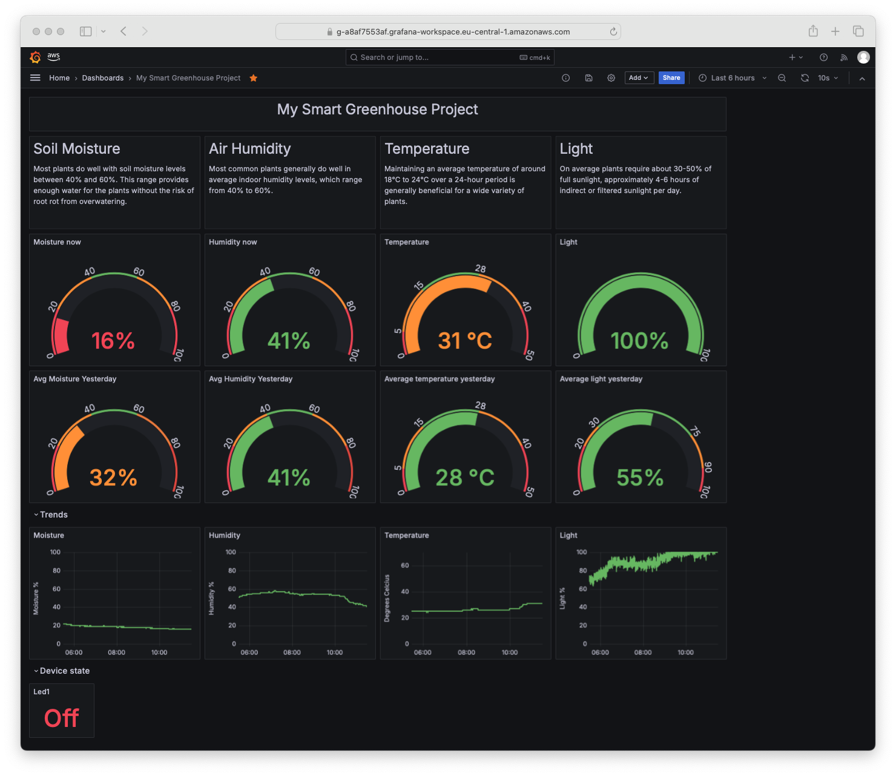
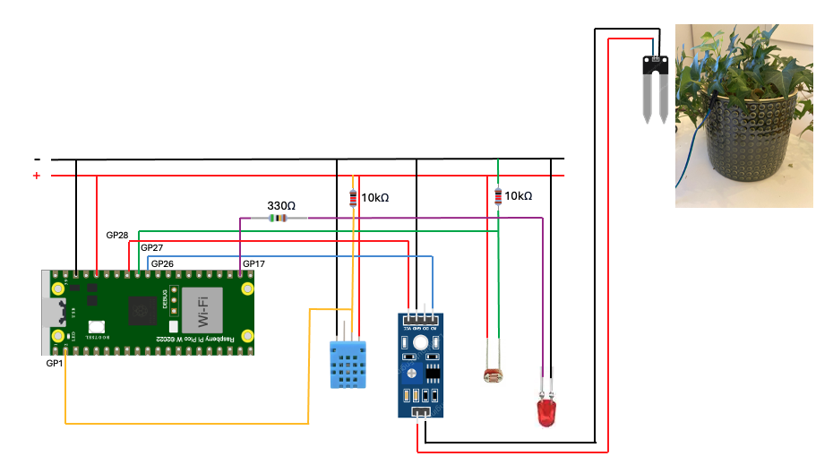
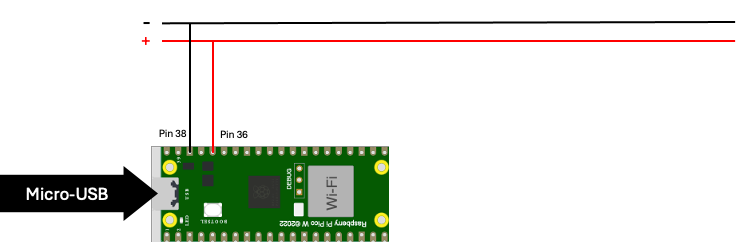
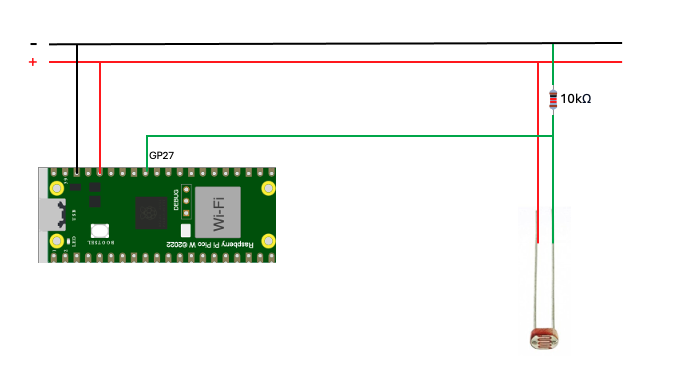
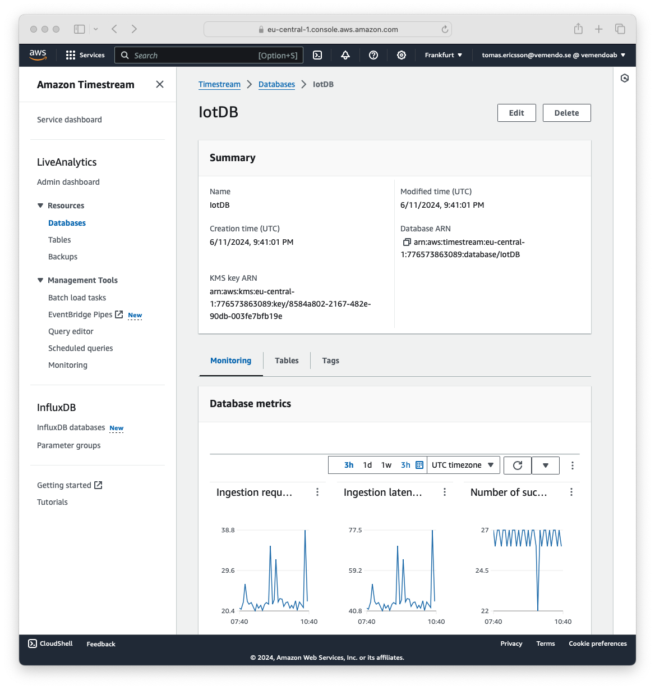
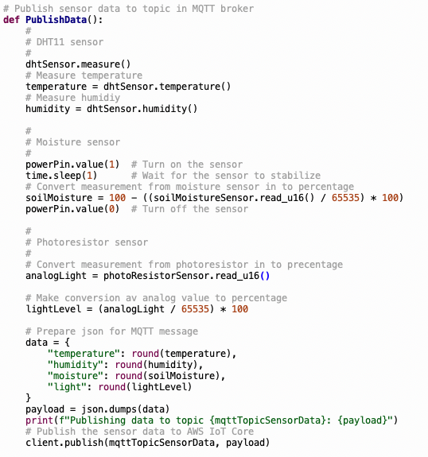

# My smart greenhouse project

## Introduction

Tomas Eriksson - te222uh

I have named my project *My Smart Greenhouse*. The goal with the project
is to create proof of concept for a Smart Greenhouse including a
prototype of an IoT hardware device and a cloud-based service to monitor
and manage a smart greenhouse remotely.

The focus in the proof of concept is to continuously monitor the climate
surrounding a plant on my desk and its soil moisture. I have also
included a first implementation of a solution to send commands to the
IoT device. As an example, this would be useful to control a watering
system remotely or controlling the light. The hardware IoT device is
built using a breadboard.

*My lab breadboard with a Raspberry Pi Pico WH with connected sensors.*

I estimate that by following my instructions and using my code you
should be able to finish your own setup in 4-8 hours. If you are not
used to working with Amazon Web Services (AWS) you might need to add
some more time for that.

## Objective

I choose this project because of a need to monitor and manage a
greenhouse I am planning at our vacation home up in the north of Sweden.
Due to the long distance from Stockholm where we live, I have a goal to
make it as "smart" as possible and automate it with the purpose to
withstand longer periods without our presence.

*Grafana dashboard providing diagrams with climate data. Hot
temperatures. Looks like the plant needs some water :)*

The proof of concept will give me insights on how to gather and
visualize greenhouse climate data through IoT using a micro controller
and hardware sensors to connect and send data to a cloud service where
the data can be monitored. I will also explore how I can send commands
to the micro controller to control outgoing ports for future automation
of a watering system and so on.

# Contents

- [My smart greenhouse project](#my-smart-greenhouse-project)
  - [Introduction](#introduction)
  - [Objective](#objective)
  - [Material](#material)
  - [Computer setup](#computer-setup)
  - [Putting everything together](#putting-everything-together)
    - [Using the Pico to power the breadboard](#using-the-pico-to-power-the-breadboard)
    - [Connecting the DHT11 sensor](#connecting-the-dht11-sensor)
    - [Connecting the moisture sensor](#connecting-the-moisture-sensor)
    - [Connecting the photoresistor](#connecting-the-photoresistor)
    - [Connecting the led](#connecting-the-led)
  - [Platform](#platform)
    - [Overview](#overview)
    - [Steps to prepare AWS for the project](#steps-to-prepare-aws-for-the-project)
      - [Timestream](#timestream)
      - [IoT Core](#iot-core)
      - [Grafana](#grafana)
  - [The code](#the-code)
    - [Files and folder structure](#files-and-folder-structure)
      - [config.py](#configpy)
      - [log.txt](#logtxt)
      - [main.py](#mainpy)
      - [Folder /umqtt/](#folder-umqtt)
      - [Folder /custom/certs/](#folder-customcerts)
    - [Core functions of the code](#core-functions-of-the-code)
      - [ConnectWiFi()](#connectwifi)
      - [ntptime.settime()](#ntptimesettime)
      - [Connect MQTT](#connect-mqtt)
      - [Log()](#log)
      - [PublishData()](#publishdata)
      - [OnActionMessage()](#onactionmessage)
      - [Main loop](#main-loop)
  - [Downloading the code](#downloading-the-code)
  - [Transmitting the data / connectivity](#transmitting-the-data--connectivity)
  - [Presenting the data](#presenting-the-data)
    - [Creating visualizations (Widgets)](#creating-visualizations-widgets)
  - [Conclusions](#conclusions)

## Material

The implementation of my smart greenhouse is based on a hardware IoT
device with sensors. Here I will list and explain all the hardware
material needed for the project.

The main hardware component of the IoT device is a Raspberry Pi Pico WH.
The Pico is a microcontroller board easy to connect to breadboards
without the need for additional soldering. As a microcontroller it
serves as the brain of the IoT device controlling and processing data
from its attached sensors.

The WH means that it has a built-in Wi-Fi module, which enhances its
suitability for IoT projects by providing wireless communication
capabilities. The board includes 26 multi-function GPIO pins that can be
used for digital and analog input and output as well as ADC ports that
can be used for analog to digital conversion which is handy when using
analog sensor devices.

The Pico is compatible with MicroPython which allows for rapid
development and code testing.

*The Raspberry Pi Pico WH*

*.*

To build the Smart Greenhouse IoT hardware device I have bought and used
the following hardware components. All components were bought from
Elektrokit.com.

| Units | Product          | Picture                                    | Description                         | Price/unit |
|-------|------------------|--------------------------------------------|-------------------------------------|------------|
| 1     | Raspberry Pi Pico WH (art no: 41019114) |  | Microcontroller with support for MicroPython. | 87.20 SEK |
| 1     | DHT11 sensor (art no: 41016231)       |  | Sensor for measuring air temperature and humidity. | 31.20 SEK |
| 1     | Photoresistor with built-in resistor (art no: 41015727) |  | Sensor for measuring light. | 31.20 SEK |
| 1     | Soil Moisture sensor (art no: 41015738) |  | Sensor for measuring soil moisture. | 23.20 SEK |
| 1     | Breadboard (art no: 10160840)         |  | Lab board to connect devices to the microcontroller. | 55.20 SEK |
| 1     | Led 2V/25mA (art no: 40307020)         |  | Red LED used to show status during start-up and test remote command execution. | 4 SEK |
| 1     | USB cable (art no: 41003290)           |  | Connects Raspberry Pi Pico WH to computer or power adapter. | 31.20 SEK |
| 1     | Resistor 330Ω (art no: 40810233)       |  | Resistor used to lower voltage for LED to less than 2V. | 0.8 SEK |
| 1     | Resistor 1kΩ (art no: 40810310)        |  | Pull-up resistor for DHT11 sensor. | 0.8 SEK |
| 1     | Connection wires for breadboard male-male (art no: 41012684) |  | Wires to connect devices on breadboard. | 39.20 SEK |

## Computer setup

I use my personal Macbook Pro with MacOS/X but the same can be achieved
using a PC and Windows. For the proof of concept, I decided to use
Thonny as IDE. Normally I work with VS Code but after reading about
Thonny I got curious and wanted to test it out. It has worked very well
for the project so far but I will probably switch to VS Code if the
project grows from a proof of concept into a full implementation.

I followed this guide <https://hackmd.io/@lnu-iot/SyTPrHwh_> to install
Thonny on my Mac and get it up and running with the Pico device.

        | ele     |                         |        |
|     |                  | ctrokit |                         |        |
|     |                  | (1 av   |                         |        |
|     |                  | 2)" width="604" height="498">

*Thonny IDE*

In Thonny when connected to the Pico you have your local files and files
on the Pico to the left. While developing it is practical to test the
code by using a local .py file that will run on the Pico when pressing
Run. You will then be able to see console prints from the code running
on the Pico in the Shell window. Good for debugging.

When you feel ready to test your code on its own on the Pico without the
connection to Thonny you save the code in a file named main.py in the
root folder of the Pico storage. Next time the Pico starts without
connection it will automatically run main.py.

After completing the installation of Thonny I followed the Applied IoT
roadmap and updated the Pico firmware described in this guide
<https://hackmd.io/@lnu-iot/rkFw7gao_>

I used the latest stable Pico W firmware from micropython.org. At the
time version v1.23.0. The development environment is now up and running.

One tip if you are invited late into the course like me, and haven't
received the hardware, is to start with writing a mqtt client in
standard Python. In my case I already had the cloud-service up and
running with a mqtt client simulating random sensor values. When I
received the hardware, it wasn't too much work to port it into
MicroPython and it saved me from the stress waiting.

## Putting everything together

The following circuit diagram describes how all the hardware was put
together. The plant in the diagram was used with a soil moisture probe.
Using the breadboard makes setting up the lab environment easy with no
need for soldering. Here follows a breakdown on how everything was
connected and resistor calculations.

### Using the Pico to power the breadboard

The Pico will receive its power from the connected USB cable. A good
practice when using a breadboard is to use the horizontal plus (+) and
minus (-) sockets. I choose to connect minus to pin 38 on the Pico which
is a ground pin (GND) and the plus to pin 36 which provides 3V3 out. Now
the board is ready for the rest of the devices. If 5V out is needed for
any device there is also VBUS pin 40. Be careful however not to put too
much load on the Pico, consider using a separate power source instead to
avoid damaging it.

### Connecting the DHT11 sensor

The DHT11 sensor has four pins, from left 1-4 (pin 3 is not in use).

Connect pins as following:

-   Pin 1 is connected to plus on the breadboard

-   Pin 4 to minus on the breadboard

-   Pin 2 is connected to pin 2 (GP1) on the Pico

-   Per instruction from the DHT11 vendor also connect a 10kΩ pull-up
    resistor\* to pin 2 from plus on breadboard.

\*The pull-up resistor helps stabilize the signal and ensures that the
data line is properly driven high when the DHT11 is not actively pulling
it low.

### Connecting the moisture sensor

Connect probe to moisture sensor using two wires and put probe into the
soil.

The moisture sensor has 4 pins, from left 1-4.

Connect pins on moisture sensor as following:

-   Connect pin 4 to pin 34 (GP28) on Pico\*

-   Connect pin 3 to minus on breadboard

-   Connect pin 1 to pin 31 (GP26) on Pico

\*As the probe passes current through the soil, it carries ions that
will damage the surface layer over time. As such the sensor should not
be operated permanently. Instead, it should only be powered up when a
measurement is taken and then instantly shut down again. By using a GP28
on the Pico as power pin we can turn on power when we use the sensor and
off again when we are done.

### Connecting the photoresistor

The photoresistor sensor has three pins, from left 1-3.

Connect pins on the photoresistor as following:

-   Connect pin 1 to pin 32 (GP27) on Pico

-   Connect pin 2 to plus on breadboard

-   Connect pin 3 to minus on breadboard

Note that the photoresistor has a built-in 10kΩ inline resistor so there
is no need for an external one when connecting it to the Pico.

### Connecting the led

Before connecting the led we need to calculate the optimal additional
resistance needed to meet the led specification that reads 2V and 25mA.
Since the plus circuit on the breadboard delivers 3.3V we need to lower
the voltage with at least 1.3V. We calculate the resistance needed to
achieve that using the formula R = U/I which gives us 1.3V/0.025A = 52Ω.
The smallest resistor I have is 330Ω which will result in a dimmer led
but not damage it. I test using the 330Ω resistance and think it doesn't
dim the led to much.

Connect pins on the led as following:

-   The longer led leg (anode) is connected to the 330Ω resistance on
    breadboard

-   The resistance is connected to pin 22 (GP17) on Pico

-   The shorter led leg (cathode) is connected to minus on the
    breadboard

## Platform

### Overview

For my project I choose to use Amazon Web Services (AWS) as a
cloud-based IoT platform. I have long experience from working with AWS
in my work but not with its IoT specific services and felt that it would
be a great time learn more about them as well.

For the project I mainly used the following AWS services

-   Amazon IoT Core as MQTT broker to which my IoT hardware connects

-   Amazon Timestream as database to store sensor data

-   Amazon managed Grafana for visualizations

The picture describes the flow in the system from the IoT hardware
device sending messages to the MQTT broker. Amazon IoT Core using rules
to trigger on relevant messages and store them in tables in the
Timestream database.

From the other end the dashboard in Grafana can use SQL queries to fetch
the data from Timestream and present it in different diagrams to the
end-user.

Here follows a summary of the different AWS services and how they are
used in this project.

#### Amazon IoT Core

AWS IoT Core is a managed cloud service that allows devices to connect
and interact using the MQTT protocol, a lightweight messaging protocol
ideal for IoT applications due to its low bandwidth usage and efficient
message delivery. It ensures secure and reliable communication between
devices and the cloud, enabling real-time data processing and
management.

#### Amazon Timestream

Amazon Timestream is a purpose-built time series database designed to
handle large-scale data generated by IoT applications. It integrates
seamlessly with AWS IoT Core, enabling efficient storage and querying of
time-stamped data from connected devices. Using MQTT, devices send
telemetry data to AWS IoT Core, which can then route this data directly
to Amazon Timestream for real-time analytics and long-term storage. This
integration allows for efficient processing and analysis of IoT data,
supporting use cases such as monitoring, predictive maintenance, and
real-time decision-making. For more details, visit the AWS IoT Core
Overview and Amazon Timestream pages.

#### Amazon Managed Grafana

Amazon Managed Grafana is a fully managed service that integrates
seamlessly with Amazon Timestream, providing powerful visualization
capabilities for time series data. By connecting Amazon Managed Grafana
with Amazon Timestream, users can easily visualize IoT data collected
and stored from AWS IoT Core. This integration enables the creation of
real-time dashboards and historical data analysis, helping to monitor
IoT device performance, track trends, and gain insights from the data.
For more details, visit the AWS IoT Core Overview and Amazon Timestream
pages.

#### Costs using Amazon Web Services

One advantage using AWS managed services in a proof of concept is that
AWS offers free usage of their services up to a specified limit called
AWS free tier. Normally you can make proof of concepts using only free
tier services. Free tier could even be enough for smaller projects in
production.

If needed there is no problem to scale up in AWS to handle millions of
IoT devices but of course at a cost that needs to be motivated by a
business plan.

As with all managed cloud services it is of course important to pay
attention to accruing costs to avoid unpleasant surprises.

### Steps to prepare AWS for the project

This chapter gives an overview of what had to be prepared in AWS for the
project. For even more details I have added a how-to here.

#### Timestream

In Timestream I have created a database and two tables to store the data
from the IoT device. One table is used for sensor data and the other one
for states from the device. To illustrate this my IoT device sends state
if the led is turned on or off.

*The database IotDB*

*The two tables SensorData and DeviceState*

By using the query editor we can see how the data from the IoT device is
stored in the tables. The column device is fixed column always set to
Pico1 for my IoT device. The data from the MQTT message is stored in the
columns measure_name and measure_value. This makes it easy and flexible
to add more sensors to the IoT device without any changes to the data
model. Every value also get a timestamp when they are stored which makes
it easy to create time series in Grafana.

*Using the query editor in Timestream to view table contents.*

#### IoT Core

In IoT Core we need to create a Thing for our IoT device. Things are
what AWS calls IoT devices. When creating a new thing you will get the
client certificates for the MQTT connection that are required to
authenticate the device.

*The IoT device represented as a Thing in IoT Core*

Message routing is used to route IoT device data to other AWS services,
in my case the Timestream database.

I have created two rules. One for sensor data and one for states. A rule
tells AWS IoT what to do when it receives messages from devices. It
extracts data from messages and invoke actions, in this case to store
the data in a Timestream table.

For the sensor data rule, I use the SQL statement:

*SELECT temperature, humidity, moisture, light FROM
\'device/pico1/data\'*

And for the states rule:

*SELECT led1 FROM \'device/pico1/state\'*

In the sensor data rule, it looks for messages with topic
device/pico1/data and selects temperature, humidity, moisture, light to
be included.

*IoT rules*

*Rule to route device data to Timestream*

#### Grafana

In AWS Managed Grafana I have added the Timestream database as a data
source. When creating dashboards and diagrams I can use SQL statements
to fetch data from the Timestream database but more on this later on.

*Adding Timestream as a data source in Grafana*

## The code

The big part of the code in the project is written in MicroPython to run
on the Pico device.

The main thing about running MicroPython code on the Pico device is that
it must run in a never-ending loop. Without the loop the program will
stop as soon as it ends, and the Pico will stop fetching data from its
sensors.

The code can be divided into the following steps:

Initialization

-   Importing required modules

-   Setting global variables

Perform one-time tasks

-   Connect to WiFi

-   Set the time and date on the Pico by fetching it from the Internet

-   Connect device to the MQTT broker in AWS IoT Core

Perform recurring tasks (while true loop)

-   Check if there are any messages in AWS IoT for the device

-   Measure and publish sensor data to the MQTT broker

Log and exception handling

-   Log events to log.txt on device based on log level

-   Catch exceptions and log stack trace. Try to recover the IoT device
    service by automatic reset. Useful if the Wi-Fi is temporary down.

-   Flash led to visualize where in the program the device is

### Files and folder structure

Here is an overview on files and folders on the Pico.

#### config.py

I use a separate config.py file to store sensitive configuration
parameters. In this case I have only stored my local Wi-Fi SSID and
password since they will not be the same in someone else environment.
All other variables are set directly to make it more visible to someone
else reading the code. config.py is imported in main.py and parameters
are addressed using for example config.ssid.

##### log.txt

Log file created by the log function in the program. It can be
configured to use different log levels from INFO to DEBUG.

#### main.py

This is the main program. The Pico will run it automatically when
starting up.

#### Folder /umqtt/

Most of the code is based on standard modules in MicroPython with one
exception. The MQTT client has been downloaded and stored under the
folder /umqtt/ as simple.py.

#### Folder /custom/certs/

To connect and authenticate the MQTT client to AWS IoT Core client
certificates are required. The certificates are downloaded when creating
a new client in AWS IoT Core and stored in the device storage in folder
/custom/certs. To function out of the box with the code make sure that
the file names are the same as listed below.

### Core functions of the code

#### ConnectWiFi()

ConnectWiFi() is the function responsible for connecting to the Wi-Fi
network. It uses the network module Wi-Fi ssid and password.

#### ntptime.settime()

A small but important function to get the correct date and time on the
Pico is the ntptime.settime() function. Date and time are used to
timestamp log entries in log.txt and when validating certificates.
Without correct time the Pico cannot connect to the MQTT broker due to
error validating certificates. Since the Pico cannot keep time and date
when it is turned off, we need to get the time from the Internet during
startup. I use the ntptime module to achieve this.

#### Connect MQTT

We use the external module umqtt to create our MQTT client and connect
to AWS IoT Core. What makes the connection to AWS IoT Core a bit more
complicated is that it requires client certificates to authenticate the
IoT device. The client uses the certificates that I downloaded from AWS
IoT Core.

#### Log()

The log function manages different log levels and gives log.txt a nice
format with timestamp and message.

#### PublishData()

Publish data measures data from sensors and publish it to AWS IoT Core
topic device/pico1/data.

The DHT sensor delivers digital values that don't need any further
calculations. The soil moisture sensor and photoresistor however needed
some calculations to achive the goal to present moisture with percentage
where 0% is completely dry and 100% is totally wet. I found that the max
value from the sensor was 65535 and could therefor use it in a formula
to calculate the moisture level in percentage.

I didn't experience the same luck with the photoresistor but found an
estimated max value by testing the sensor on my own. I found that its
maximum was somewhere around 1500 when in full light. Since it is not an
exact value, I added a check that makes sure that we never get a slip to
a negative result.

For future needs I will check for a better photoresistor to measure
light, but it will do for thus proof of concept.

#### OnActionMessage()

This little function is just an embryo to future functions where
commands are sent to the Pico enabling it to turn on watering systems
and other interesting things that could be automated in a smart
greenhouse.

The function is automatically called when a message arrives to a
subscribed topic

I my simple example it takes two commands "turn on led1" and "turn off
led1" which turns on and off the physical led on the breadboard. It also
publishes the new state so it can be visualized on the Grafana
dashboard.

#### Main loop

The main loop has two tasks. The first is to check for new incoming MQTT
messages and the second is to call PublishData that measures and sends
sensor data to AWS IoT Core. When it is done it sleeps for 10 seconds
before returning to the loop.

One nice feature I added is exception handling including writing the
error message to the log and restarting the Pico after waiting 60
seconds. This way the device can get online again with human interaction
after e.g. network failures.

### Downloading the code

You can download the latest code here....

## Transmitting the data / connectivity

I use Wi-Fi and the Internet to transmit the sensor data over the MQTT
protocol to AWS IoT Core.

With my objective to use the IoT device in a greenhouse I am planning at
our vacation home up in the north of Sweden Wi-Fi is the best option
right now. We have good Internet connectivity with fiber installed in
the house. The greenhouse will be in within Wi-Fi reach and external
power is not an issue.

I also bought an antenna for LoRa and signed up for a Helium account but
didn't have the time to find a place where I could both work and be in
reach of the Helium network at the same time. It would however be
interesting to continue to explore LoRa and Helium after this course.

Currently my IoT device measures sensor data and transmits it every 10
second.

## Presenting the data

I have created a dashboard for my project in Grafana. I have three
different types of diagram visualizations where I present sensor data
from the Timestream database.

The first is a Gauge meter presenting the current (latest) value from
the sensors. The second calculates the average value from the sensors
the day before. The last is a Times series diagram showing history and
trends.

*The dashboard consisting of a set of diagrams per sensor and a display
showing the current state of the Led.*

### Creating visualizations (Widgets)

Visualizations are mainly using a SQL query creating a data set. The
current value is using a simple query fetching the latest value from the
Timestream table.

Example

SELECT \* FROM \$\_\_database.\$\_\_table WHERE measure_name =
\'humidity\'

ORDER BY time DESC LIMIT 1

A more advanced example calculating the average value from the day
before using the following SQL query:

SELECT

DATE(time) AS date,

AVG(measure_value::bigint) AS average_value

FROM

\$\_\_database.\$\_\_table

WHERE

time \< CURRENT_DATE and measure_name = \'humidity\'

GROUP BY

DATE(time)

ORDER BY

DATE(time) DESC LIMIT 1

I have applied general thresholds for a houseplant to visualize if the
plant has optimal conditions. Green is good while orange and red are not
optimal.

*Visualizations are created using a SQL query creating a data set. There
are many types of diagrams to choose from and settings to customize
them.*

The visualization showing led state is a bit special. It uses a
visualization called stat that checks if the last value is On or Off and
displays a red "Off" or green "On" depending on the value.

*Using visualization Stat in Grafana to check and display state of the
Led connected to the Pico.*

Currently IoT data is preserved for 12 months. While the IoT device is
running new data is saved to the database every time a new message to
IoT Core, currently every 10 seconds. This means that we can use the
dashboard to see trends 12 months back in time.

For more information on the Timestream database see the platform
chapter.

## Conclusions

Building an IoT device for my smart greenhouse using AWS IoT services
and Grafana has been both a fun and rewarding experience. I think the
most fun part has been building the hardware and MicroPython programming
but also to see that it was seamless to integrate it with a powerful
cloud platform like AWS.

It has also been fun to learn about parts of AWS I haven't explored
before. IoT Core provides a secure way to connect IoT devices using
client certificates and two-way TLS encryption. Timestream facilitated
efficient data storage and querying, while AWS Managed Grafana offered
powerful visualization tools for monitoring greenhouse conditions.

I hope to continue the work turning the proof of concept into a real
implementation in my planned Greenhouse.
