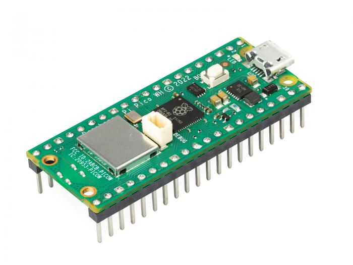

# Tutorial on how to build a IoT solutions for your smart greenhouse

## Introduction

Tomas Eriksson - te222uh

I have named my project *My Smart Greenhouse*. The aim with the project
is to create proof of concept for a Smart Greenhouse including a protype
of an IoT hardware device and a cloud-based service to monitor and
manage a smart greenhouse remotely.

The focus at this stage of the project is on monitoring the climate in
the greenhouse and soil moisture but I have also included a first
implementation sending commands to the remote device. As an example,
would this be useful to control a watering system remotely.

I estimate that by following my instructions and using my code you
should be able to finish your own setup in 8-16 hours.

Out of scope for this tutorial is how to use and sign up for an AWS
account (Amazon Web Services).

*Give a short and brief overview of what your project is about. What
needs to be included:*

-   *Title*

-   *Your name and student credentials (xx666x)*

-   *Short project overview*

-   *How much time it might take to do (approximation)*

## Objective

I choose this project because of a need to monitor and manage a
greenhouse I am planning at our vacation home up in the north of Sweden.
Due to the long distance from Stockholm where we live, I aim to make it
as "smart" as possible and automate it to withstand longer periods
without our presence.

The proof of concept will give me insights on how to gather greenhouse
climate data through IoT using a micro controller and hardware sensors
to connect and send data to a cloud service where the data can be
monitored. I will also explore how I can send commands to the micro
controller to control outgoing ports for future automation of a watering
system and so on.

*Describe why you have chosen to build this specific device. What
purpose does it serve? What do you want to do with the data, and what
new insights do you think it will give?*

-   *Why you chose the project*

-   *What purpose does it serve*

-   *What insights you think it will give*

## Material

The implementation of my smart greenhouse is based on a hardware IoT
device with sensors and a cloud-based service including a MQTT (Message
Queuing Telemetry Transport) broker, a database and a web-based tool to
visualize and monitor data from the IoT device. In this chapter I will
list and explain all the hardware material needed for the project.

The main hardware component of the IoT device is a Raspberry Pi Pico WH.
The Pico is a microcontroller board easy to connect to breadboards
without the need for additional soldering. As a microcontroller it
serves as the brain of the IoT device controlling and processing data
from attached sensors.

The WH means that it has a built-in Wi-Fi module, which enhances its
suitability for IoT projects by providing wireless communication
capabilities. The board includes 26 multi-function GPIO pins that can be
used for digital and analog input and output as well as ADC ports that
can be used for analog to digital conversion which is handy when using
analog sensor devices.

The Pico is compatible with MicroPython which allows for rapid
development and testing of code.

{width="2.5573786089238846in"
height="3.409838145231846in"}

*The Raspberry Pi Pico WH in action on the breadboard*

*with connected sensors.*

To build the Smart Greenhouse IoT hardware device I have bought and used
the following hardware components. All components were bought from
Elektrokit.com.

*Explain all material that is needed. All sensors, where you bought them
and their specifications. Please also provide pictures of what you have
bought and what you are using.*

-   *List of material*

-   *What the different things (sensors, wires, controllers) do - short
    specifications*

-   *Where you bought them and how much they cost*

| Units | Product          | Picture                                    | Description                         | Price/unit |
|--------|------------------|--------------------------------------------|-------------------------------------|------------|
| 1      | Raspberry Pi Pico WH (art no: 41019114) |  | Microcontroller with support for MicroPython. | 87.20 SEK |
| 1      | DHT11 sensor (art no: 41016231)       |  | Sensor for measuring air temperature and humidity. | 31.20 SEK |
| 1      | Photoresistor with built-in resistor (art no: 41015727) |  | Sensor for measuring light. | 31.20 SEK |
| 1      | Soil Moisture sensor (art no: 41015738) |  | Sensor for measuring soil moisture. | 23.20 SEK |
| 1      | Breadboard (art no: 10160840)         |  | Lab board to connect devices to the microcontroller. | 55.20 SEK |
| 1      | Led 2V/25mA (art no: 40307020)         |  | Red LED used to show status during start-up and test remote command execution. | 4 SEK |
| 1      | USB cable (art no: 41003290)           |  | Connects Raspberry Pi Pico WH to computer or power adapter. | 31.20 SEK |
| 1      | Resistor 330Ω (art no: 40810233)       |  | Resistor used to lower voltage for LED to less than 2V. | 0.8 SEK |
| 1      | Resistor 1kΩ (art no: 40810310)        |  | Pull-up resistor for DHT11 sensor. | 0.8 SEK |
| 1      | Connection wires for breadboard male-male (art no: 41012684) |  | Wires to connect devices on breadboard. | 39.20 SEK |

## Computer setup

I use my personal Macbook Pro with MacOS/X but the same can be achieved
using a PC and Windows.

For this proof of concept, I choose to use Thonny as IDE. Normally I
prefer VS Code but reading about Thonny I got curious and wanted to test
it out. It has worked very well so far but I will probably switch to VS
Code if the project grows into a full implementation.

After installing Thonny I did the following steps to get my computer
ready for programming the Pico using MicroPython.

### Updating firmware on Pico

I downloaded the latest stable Pico W firmware from micropython.org. At
the time v1.23.0.

The firmware is updated using the following 4 steps:

-   Connect micro-USB end of the USB cable to the Pico.

-   While holding the button (BOOTSEL) on the Pico connect the other end
    of the USB cable to your computer. A new Finder window will open
    showing the Pico storage.

-   Copy the downloaded firmware file (with file extension ".uf2") and
    paste it to the storage.

-   Wait until the board automatically disconnects from your computer
    and the new drive disappear.

-   Disconnect the USB cable from your computer and connect it again.
    Your Pico is now ready to go to work.

### Executing a first line of code from your Pico

From Thonny you should now be able to select the Pico in the bottom
right corner of the window. By entering a line of MicroPython code into
the Shell window you can test that everything works.

{width="5.579126202974628in"
height="1.0952843394575678in"}

On the left side you have both local files and files on the Pico. While
developing it is practical to test the code by using a local .py file
that will run on the Pico when pressing Run. You will then be able to
see prints from the code running on the Pico in the Shell window. Good
for debugging.

When you feel ready to test your code on its own without the connection
to Thonny you save the code in a file named main.py in the root of the
Pico storage. Next time the Pico starts without connection it will
automatically run main.py.

How is the device programmed. Which IDE are you using. Describe all
steps from flashing the firmware, installing plugins in your favorite
editor. How flashing is done on MicroPython. The aim is that a beginner
should be able to understand.

-   Chosen IDE

-   How the code is uploaded

-   Steps that you needed to do for your computer. Installation of
    Node.js, extra drivers, etc.

## Putting everything together

The following circuit diagram describes how the hardware was put
together. The plant in the diagram was used with soil moisture sensor.
Using the breadboard makes setting up the lab environment easy with no
need for soldering.

{width="6.3in"
height="3.4097222222222223in"}

Here is a breakdown on how everything was connected and resistor
calculations.

### Using the Pico to power the breadboard

The Pico will receive its power from the connected USB cable. A good
practice when using a breadboard is to use the horizontal plus (+) and
minus (-) sockets. I choose to connect minus to pin 38 on the Pico which
is a ground pin (GND) and the plus to pin 36 which provides 3V3 out. Now
the board is ready for the rest of the devices. If 5V out is needed for
any device there is also VBUS pin 40. Be careful however not to put too
much load on the Pico, consider using a separate power source instead to
avoid damaging it.

{width="6.3in" height="2.06875in"}

### Connecting the DHT11 sensor

The DHT11 sensor has four pins, from left 1-4 (pin 3 is not in use).

Connect pins as following:

-   Pin 1 is connected to plus on the breadboard

-   Pin 4 to minus on the breadboard

-   Pin 2 is connected to pin 2 (GP1) on the Pico

-   Per instruction from the DHT11 vendor also connect a 10kΩ pull-up
    resistor\* to pin 2 from plus on breadboard.

{width="4.7730643044619425in"
height="2.5001760717410324in"}

\*The pull-up resistor helps stabilize the signal and ensures that the
data line is properly driven high when the DHT11 is not actively pulling
it low.

### Connecting the moisture sensor

The moisture sensor has 4 pins, from left 1-4.

Connect probe to moisture sensor using two wires and put probe into the
soil.

Connect pins on moisture sensor as following:

-   Connect pin 4 to pin 34 (GP28) on Pico\*

-   Connect pin 3 to minus on breadboard

-   Connect pin 1 to pin 31 (GP26) on Pico

{width="6.3in"
height="3.4097222222222223in"}

\*As the probe passes current through the soil, it carries ions that
will damage the surface layer over time. As such the sensor should not
be operated permanently. Instead, it should only be powered up when a
measurement is taken and then instantly shut down again. By using a GP28
on the Pico as power pin we can turn on power when we use the sensor and
off again when we are done.

### Connecting the photoresistor

The photoresistor sensor has three pins, from left 1-3.

Connect pins on the photoresistor as following:

-   Connect pin 1 to pin 32 (GP27) on Pico

-   Connect pin 2 to plus on breadboard

-   Connect pin 3 to minus on breadboard

Note that the photoresistor has a built-in 10kΩ inline resistor so there
is no need for an external one when connecting it to the Pico.

{width="5.647120516185477in"
height="2.9486778215223097in"}

### Connecting the led

Before connecting the led we need to calculate the optimal additional
resistance needed to meet the led specification that reads 2V and 25mA.
Since the plus circuit on the breadboard delivers 3.3V we need to lower
the voltage with at least 1.3V. We calculate the resistance needed to
achieve that using the formula R = U/I which gives us 1.3V/0.025A = 52Ω.
The smallest resistor I have is 330Ω which will result in a dimmer led
but not damage it. I test using the 330Ω resistance and think it doesn't
dim the led to much.

Connect pins on the led as following:

-   The longer led leg (anode) is connected to the 330Ω resistance on
    breadboard

-   The resistance is connected to pin 22 (GP17) on Pico

-   The shorter led leg (cathode) is connected to minus on the
    breadboard

{width="6.3in"
height="3.3513888888888888in"}

How is all the electronics connected? Describe all the wiring, good if
you can show a circuit diagram. Be specific on how to connect
everything, and what to think of in terms of resistors, current and
voltage. Is this only for a development setup or could it be used in
production?

-   Circuit diagram (can be hand drawn)

-   \*Electrical calculations

## Platform

### Overview

For my project I choose to use Amazon Web Services (AWS) as IoT
platform. AWS offers of a comprehensive suite of managed cloud services.
For my project I needed a MQTT broker that is provided by Amazon IoT
Core, a database to store sensor data provided by Amazon Timestream and
a visualization tool where I choose to use an AWS Managed Grafana.

{width="5.382270341207349in"
height="3.8082884951881013in"}

The picture describes the flow from the IoT hardware device sending
messages to the MQTT broker. Amazon IoT Core uses rules to trigger on
relevant messages and store them in tables in the Timestream database.
From the other end the dashboard in Grafana can use SQL queries to fetch
the data from Timestream and present it in different diagrams to the
end-user.

Here follows a summary of the different AWS services used in this
project.

#### Amazon IoT Core

AWS IoT Core is a managed cloud service that allows devices to connect
and interact using the MQTT protocol, a lightweight messaging protocol
ideal for IoT applications due to its low bandwidth usage and efficient
message delivery. It ensures secure and reliable communication between
devices and the cloud, enabling real-time data processing and
management. For more details

#### Amazon Timestream

Amazon Timestream is a purpose-built time series database designed to
handle large-scale data generated by IoT applications. It integrates
seamlessly with AWS IoT Core, enabling efficient storage and querying of
time-stamped data from connected devices. Using MQTT, devices send
telemetry data to AWS IoT Core, which can then route this data directly
to Amazon Timestream for real-time analytics and long-term storage. This
integration allows for efficient processing and analysis of IoT data,
supporting use cases such as monitoring, predictive maintenance, and
real-time decision-making. For more details, visit the AWS IoT Core
Overview and Amazon Timestream pages.

#### Amazon Managed Grafana

Amazon Managed Grafana is a fully managed service that integrates
seamlessly with Amazon Timestream, providing powerful visualization
capabilities for time series data. By connecting Amazon Managed Grafana
with Amazon Timestream, users can easily visualize IoT data collected
and stored from AWS IoT Core. This integration enables the creation of
real-time dashboards and historical data analysis, helping to monitor
IoT device performance, track trends, and gain insights from the data.
For more details, visit the AWS IoT Core Overview and Amazon Timestream
pages.

#### Costs using Amazon Web Services

One advantage using AWS managed services in a proof of concept is that
AWS offers free usage of their services up to a specified limit called
AWS free tier. Normally you can make proof of concepts using only free
tier services.

As with all managed cloud services it is of course important to pay
attention to accruing costs to avoid unpleasant surprises.

### Preparing the AWS environment

If you want to prepare the same setup in AWS as I have you can follow
these steps.

#### IoT Core -- Create MQTT Client

To enable our Pico device to connect to IoT Core as a MQTT Client we
first need to create an identity with credentials for it in IoT Core.

1.  In the AWS web console go to service AWS IoT Core and navigate to
    Manage/ Things and there select to create a new single Thing. Things
    are what AWS call IoT devices. Select Thing type sensor and device
    shadow to no shadow.

2.  In the configure device certificate step select option auto-generate
    a new certificate

3.  In the attach policies to certificate step select to create a new
    policy. For now give full access to all IoT resources, see example
    json below\
    \
    {width="2.2582797462817146in"
    height="2.1219313210848645in"}

4.  Download certificates and store them in a folder. You will have to
    transfer these to the Pico storage to be able to connect to IoT
    core.

#### Timestream -- Create Database and tables

First we need to create a Timestream database.

1.  In the AWS web console go to service TimeStream and navigate to
    databases and select create database. Select standard database and
    name it IotDB if you want it to work with other examples used in
    this tutorial.

2.  Save the database

Next, we create two tables. The first table named SensorData is used to
store sensor data. The second is used to store states from the device
e.g. if the led is on and so on.

1.  Select Tables and Create Table.

2.  Choose IotDB as database and name table SensorData

3.  In schema settings select custom partitioning and choose partition
    key type Dimension and set Partition key name to Custom

4.  Uncheck Enforce partition key in record

5.  In Data retention make settings that suits your needs e.g. memory
    store retention 1 week and 1-day magnetic store retention.

6.  I skipped magnetic storage by unchecking Enable magnetic storage
    writes.

7.  Select Create Table

Repeat Create table for a table named DeviceState.

#### IoT Core -- Create rules to store IoT data in TimeStream database table

Rules are used to read and filter incoming messages from the device. We
need two rules that will filter messages based on topic and depending on
topic store data in our two tables. The first rule will fetch
temperature, humidity, moisture and light from messages with topic
device/pico1/data which is the topic that the Pico will use when sending
sensor data to IoT Core.

The second rule will fetch led1 status from topic device/pico1/state
which is the topic that the Pico will use when it sends messages about
led status changes.

Create the first rule as follows.

1.  In the AWS web console go to service AWS IoT Core and navigate to
    Message Routing / Rules. Select Create rule.

2.  Name the rule Pico1

3.  Add SQL statement to query IoT Core topics\
    SELECT temperature,humidity,moisture,light FROM
    \'device/pico1/data\'

4.  In Rule actions select Timestream Table

5.  Choose database IotDB

6.  Choose table SensorData

7.  Enter dimension name "device" and dimension value "pico1"

8.  Enter timestamp value \${timestamp()} and select unit MILLISECONDS

9.  In IAM role select Create new role and name it e.g. Pico1Role. AWS
    will automatically create and attach a policy to it allowing write
    access to the Timestream table.

10. Select Create.

Repeat the same steps for a second rule named Pico1_state but with the
following adjustments.

In 3 replace SQL statement with SELECT led1 FROM \'device/pico1/state\'

#### Grafana

To prepare Grafana to present data from our Timestream tables we need to
add Timestream as a data source. We will later explore how we can
present it in dashboards using different diagram types.

1.  Sign in to Grafana as administrator

2.  Navigate to Data sources and Select Add new data source

3.  Search for Timestream and select it

4.  Assign the datasource a name

5.  Set default region to the region where you have your Timestream DB
    e.g. eu-central-1

6.  Set default database, table and measure to IotDB, SensorData and
    temperature.

Our AWS environment is now ready to start managing data from the Pico
device.

Describe your choice of platform. If you have tried different platforms
it can be good to provide a comparison.

Is your platform based on a local installation or a cloud? Do you plan
to use a paid subscription or a free? Describe the different
alternatives on going forward if you want to scale your idea.

-   Describe platform in terms of functionality

-   \*Explain and elaborate what made you choose this platform

## The code

Most of the code is written for the Pico IoT hardware device. In AWS SQL
queries are used to select data to be stored in the Timestream database
and select data to be visualized on dashboard in Grafana. Here I will
focus on the MicroPython code and go into the SQL later in the chapter
about presenting the data.

The main thing about running MicroPython code on the Pico device is that
it must run in a never-ending loop. Without the loop the program will
stop as soon as it ends, and the Pico will stop fetching data from its
sensors.

Before starting the loop, we initialize what is needed like:

1.  Setting global variables mapping pins on Pico

2.  Connecting to Wi-Fi

3.  Fetching the current time from the Internet

4.  Connecting to MQTT broker

Something I also figured out early during the implementation is that it
is nice to have:

1.  Exception handling including an automatic restart of the device if
    experiencing a critical error like lost connection to Wi-Fi.

2.  A log function writing logs to the Pico storage.

3.  Flash led to visualize where in the initialization phase we are

One example when I had good use for the flashing led and the log is my
program stopped when starting Pico not running it from Thonny. I use a
client certificate to authenticate the IoT device with the MQTT broker
and the certificate wasn't yet valid unless the time and date on the
Pico was set before. When running from Thonny it appears to get time and
date from Thonny or the computer.

The need for exception handling and automatic restart of the device I
experienced when I wasn't home, and it lost connection to the Wi-Fi
resulting in the program stopping. Since I wasn't home, I couldn't
restart it. Now it waits 60 seconds after a critical exception and then
tries to restart which makes it come online again as soon as everything
is working again.

To visualize where in the initialization phase the device is I have
implemented a program sequence flashing the led. It flashes one time
first to show that the program has started, next it flashes two times to
show that it has successfully connected to wi-fi and lastly it flashes
three times to show that it has successfully connected to the MQTT
broker and is ready to transmit data. During the loop the moisture
sensor also flashes its built-in led every time the sensor is powered to
measure the moisture in plant soil. This shows that the loop is running.

### Files and folders

Here is an overview on files and folders on the Pico

{width="3.5201017060367454in"
height="3.04244750656168in"}

#### config.py

I use a separate config.py file to store sensitive configuration
parameters. In this case I have only stored my local Wi-Fi SSID and
password since they will not be the same in someone else environment.
All other variables are set directly in the code to make it more visible
to someone else reading the code. config.py is imported in main.py and
parameters are addressed using for example config.ssid.

##### log.txt

Log file created by the log function in the program. It can be
configured to use different log levels from INFO to DEBUG.

#### main.py

This is the main program. The Pico will run it automatically when
starting up.

#### Folder /umqtt/

Most of the code is based on standard modules in MicroPython with one
exception. The MQTT client has been downloaded and stored under the
folder /umqtt/ as simple.py.

#### Folder /custom/certs/

To connect and authenticate the MQTT client to AWS IoT Core client
certificates are required. The certificates are downloaded when creating
a new client in AWS IoT Core and stored in the device storage in folder
/custom/certs. To function out of the box with the code make sure that
the file names are the same as listed below.

### Core functions of the code

Here are some core functions in the code.

#### ConnectWiFi()

ConnectWiFi() is the function responsible for connecting to the Wi-Fi
network. It uses the network module and SSID and password.

{width="2.5370297462817146in"
height="1.0324179790026247in"}

#### ntptime.settime()

It is important that the Pico has correct data and time. Since it cannot
keep this setting when it is turned off we need to get the time from the
Internet during startup. We use the ntptime module to achieve this.

{width="3.357752624671916in"
height="0.28143044619422575in"}

#### Connect MQTT

We use the external module umqtt to create our MQTT client and connect
to AWS IoT Core. The client takes the certificates that we downloaded
from AWS as parameters. We also need to specify the IoT Core endpoint
that can be found in AWS IoT Core settings using the web console. Since
I had some issues with the date not being correct on the device and
certificates then not being valid yet I added some extra debugging in
the function.

{width="5.883829833770779in"
height="4.743642825896763in"}

#### Log()

The log function manages different log levels and gives log.txt a nice
format with timestamp and message.

{width="6.3in"
height="1.2944444444444445in"}

#### PublishData()

Publish data measures data from sensors and publish it to AWS IoT Core
topic device/pico1/data.

The DHT sensor delivers digital values that don't need any further
calculations. The soil moisture sensor and photoresistor however needed
some calculations to achive the goal to present moisture with percentage
where 0% is completely dry and 100% is totally wet. I found that the max
value from the sensor was 65535 and could therefor use it in a formula
to calculate the moisture level in percentage.

I didn't experience the same luck with the photoresistor but found an
estimated max value by testing the sensor on my own. I found that its
maximum was somewhere around 1500 when in full light. Since it is not an
exact value, I added a check that makes sure that we never get a slip to
a negative result. For future needs I will check for a better
photoresistor to measure light but it will do for thus proof of concept.

{width="6.3in"
height="5.192361111111111in"}

#### OnActionMessage()

This little function is just an embryo to future fuctions where commands
are sent to the Pico enabling it to turn on watering systems and other
interesting things that could be automated in a smart greenhouse.

The function is automatically called when a message arrives to a
subscribed topic

{width="6.3in" height="0.3729166666666667in"}

{width="4.570005468066491in"
height="0.3626990376202975in"}

I my simple example it takes two commands "turn on led1" and "turn off
led1" which turns on and off the physical led on the breadboard. It also
publishes the new state so it can be visualized on the Grafana
dashboard.

{width="3.384653324584427in"
height="1.664882983377078in"}

#### Main loop

The main loop has two tasks. The first is to check for new incoming MQTT
messages and the second is to call PublishData that measures and sends
sensor data to AWS IoT Core. When it is done it sleeps for 10 seconds
before returning to the loop.

One nice feature I added is exeption handling including writing the
error message to the log and restarting the Pico after waiting 60
seconds. This way the device can get online again with human interaction
after e.g. network failures. It la

{width="6.3in"
height="2.060416666666667in"}

Import core functions of your code here, and don\'t forget to explain
what you have done! Do not put too much code here, focus on the core
functionalities. Have you done a specific function that does a
calculation, or are you using clever function for sending data on two
networks? Or, are you checking if the value is reasonable etc. Explain
what you have done, including the setup of the network, wireless,
libraries and all that is needed to understand.

*import this as that*

*def my_cool_function():*

*print(\'not much here\')*

*s.send(package)*

*\# Explain your code!*

## Transmitting the data / connectivity

How is the data transmitted to the internet or local server? Describe
the package format. All the different steps that are needed in getting
the data to your end-point. Explain both the code and choice of wireless
protocols.

-   How often is the data sent?

-   Which wireless protocols did you use (WiFi, LoRa, etc ...)?

-   Which transport protocols were used (MQTT, webhook, etc ...)

-   \*Elaborate on the design choices regarding data transmission and
    wireless protocols. That is how your choices affect the device range
    and battery consumption.

## Presenting the data

Describe the presentation part. How is the dashboard built? How long is
the data preserved in the database?

-   Provide visual examples on how the dashboard looks. Pictures needed.

-   How often is data saved in the database.

-   \*Explain your choice of database.

-   \*Automation/triggers of the data.

## Finalizing the design

Show the final results of your project. Give your final thoughts on how
you think the project went. What could have been done in an other way,
or even better? Pictures are nice!

-   Show final results of the project

-   Pictures

-   \*Video presentation

## Conclusions
