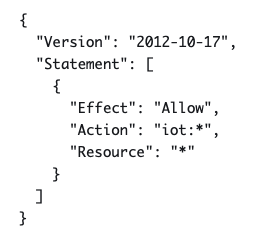

### Preparing the AWS environment in more detail

If you want to prepare the same setup in AWS as I have you can follow
these steps.

#### IoT Core -- Create MQTT Client

To enable our Pico device to connect to IoT Core as a MQTT Client we
first need to create an identity with credentials for it in IoT Core.

1.  In the AWS web console go to service AWS IoT Core and navigate to
    Manage/ Things and there select to create a new single Thing. Things
    are what AWS call IoT devices. Select Thing type sensor and device
    shadow to no shadow.

2.  In the configure device certificate step select option auto-generate
    a new certificate

3.  In the attach policies to certificate step select to create a new
    policy. For now give full access to all IoT resources, see example
    json below
    
    

4.  Download certificates and store them in a folder. You will have to
    transfer these to the Pico storage to be able to connect to IoT
    core.

#### Timestream -- Create Database and tables

First we need to create a Timestream database.

1.  In the AWS web console go to service TimeStream and navigate to
    databases and select create database. Select standard database and
    name it IotDB if you want it to work with other examples used in
    this tutorial.

2.  Save the database

Next, we create two tables. The first table named SensorData is used to
store sensor data. The second is used to store states from the device
e.g. if the led is on and so on.

1.  Select Tables and Create Table.

2.  Choose IotDB as database and name table SensorData

3.  In schema settings select custom partitioning and choose partition
    key type Dimension and set Partition key name to Custom

4.  Uncheck Enforce partition key in record

5.  In Data retention make settings that suits your needs e.g. memory
    store retention 1 week and 1-day magnetic store retention.

6.  I skipped magnetic storage by unchecking Enable magnetic storage
    writes.

7.  Select Create Table

Repeat Create table for a table named DeviceState.

#### IoT Core -- Create rules to store IoT data in TimeStream database table

Rules are used to read and filter incoming messages from the device. We
need two rules that will filter messages based on topic and depending on
topic store data in our two tables. The first rule will fetch
temperature, humidity, moisture and light from messages with topic
device/pico1/data which is the topic that the Pico will use when sending
sensor data to IoT Core.

The second rule will fetch led1 status from topic device/pico1/state
which is the topic that the Pico will use when it sends messages about
led status changes.

Create the first rule as follows.

1.  In the AWS web console go to service AWS IoT Core and navigate to
    Message Routing / Rules. Select Create rule.

2.  Name the rule Pico1

3.  Add SQL statement to query IoT Core topics\
    SELECT temperature,humidity,moisture,light FROM
    \'device/pico1/data\'

4.  In Rule actions select Timestream Table

5.  Choose database IotDB

6.  Choose table SensorData

7.  Enter dimension name "device" and dimension value "pico1"

8.  Enter timestamp value \${timestamp()} and select unit MILLISECONDS

9.  In IAM role select Create new role and name it e.g. Pico1Role. AWS
    will automatically create and attach a policy to it allowing write
    access to the Timestream table.

10. Select Create.

Repeat the same steps for a second rule named Pico1_state but with the
following adjustments.

In 3 replace SQL statement with SELECT led1 FROM \'device/pico1/state\'

#### Grafana

To prepare Grafana to present data from our Timestream tables we need to
add Timestream as a data source. We will later explore how we can
present it in dashboards using different diagram types.

1.  Sign in to Grafana as administrator

2.  Navigate to Data sources and Select Add new data source

3.  Search for Timestream and select it

4.  Assign the datasource a name

5.  Set default region to the region where you have your Timestream DB
    e.g. eu-central-1

6.  Set default database, table and measure to IotDB, SensorData and
    temperature.

Our AWS environment is now ready to start managing data from the Pico
device.
